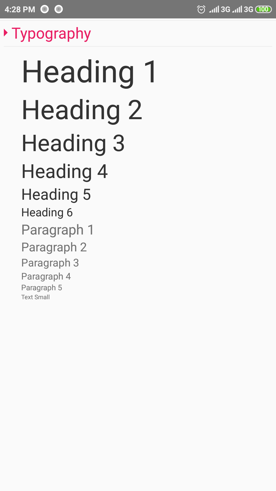
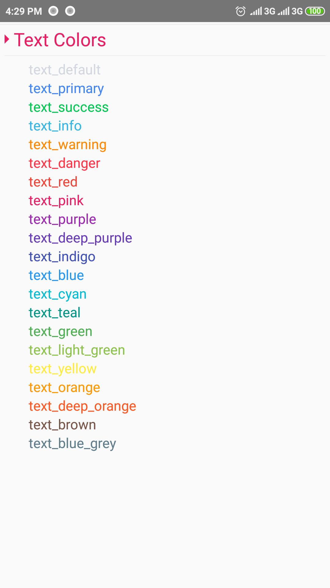

<h3 align="center">
  React Native StyleSheet
</h3>

<p align="center">
  This style sheet help you create new
  <a href="#">react-native</a> app design
</p>
<br />

<!-- ### Installation

Follow
[these instructions](https://react-native-training.github.io/react-native-elements/docs/getting_started.html)
to install React Native Elements! -->
<!-- 
### Usage

Start using the components or try it on Snack
[here](https://snack.expo.io/rJu6gJfBZ). -->


## Components included:

- [x] [Typography](#)
- [x] [Text Colors](#)
- [x] [BG Colors](#)
- [x] [Outline/Border Colors](#)
- [x] [Grid](#)
- [x] [Buttons](#)
- [x] [Button Colors](#)
- [x] [Avaters](#)
- [x] [Box and Card's](#)
- [x] [Product Cards](#)
- [x] [Content Slider](#)


## Pre Requirements:

To use this styles you need to install some other packages. This packages helps you to make a beautiful design.

  - [npm install react-native-vector-icons --save](https://github.com/oblador/react-native-vector-icons)


## My File Structure
  Before start using this package, You need to know my package file structure, for easily find any file or components.

  * [packageFolder]()
    * [src]()
      * [assets]()
        * [images]()
        * [styles]()
          * [styles.js]()
      * [components]()
        * [Avatars.js]()
        * [BgColors.js]()
        * [Box&Cards.js]()
        * [Buttons.js]()
        * [ContentSlider.js]()
        * [Grid.js]()
        * [OutlineColors.js]()
        * [ProductCards.js]()
        * [TextColors.js]()
        * [Typography.js]()
      * [includes]()
      * [pages]()
        * [index.js]()
      * [README.md]()


# Get Started

## Typography

Example Code:

```js  
import React, {Component} from 'react';
import {
  StyleSheet, 
  Text, 
  View,
  ScrollView,
} from 'react-native';
import css from '../assets/styles/styles'

export default class Typography extends Component{
  render() {
    return (
      <ScrollView
        showsVerticalScrollIndicator={false}>
          <View style={css.container_fluid}>
            <Text style={css.h1}>Heading 1 </Text>
            <Text style={css.h2}>Heading 2 </Text>
            <Text style={css.h3}>Heading 3 </Text>
            <Text style={css.h4}>Heading 4 </Text>
            <Text style={css.h5}>Heading 5 </Text>
            <Text style={css.h6}>Heading 6 </Text>

            <Text style={css.p1}>Paragraph 1 </Text>
            <Text style={css.p2}>Paragraph 2 </Text>
            <Text style={css.p3}>Paragraph 3 </Text>
            <Text style={css.p4}>Paragraph 4 </Text>
            <Text style={css.p5}>Paragraph 5 </Text>

            <Text style={css.small}>Text Small </Text>
          </View>
      </ScrollView>
    );
  }
}
```

Example:
<br>

<p align="center">
  <a href="#" target="_blank"></a>
</p>


## Text Colors

Example Code:

```js  

import React, {Component} from 'react';
import {
  StyleSheet, 
  Text, 
  View,
  ScrollView,
} from 'react-native';
import css from '../assets/styles/styles'

export default class TextColors extends Component{
  render() {
    return (
      <ScrollView
        showsVerticalScrollIndicator={false}>
          <View style={css.container_fluid}>
          <Text style={[css.h6,css.text_default]}> text_default </Text>
              <Text style={[css.h6,css.text_primary]}> text_primary </Text>
              <Text style={[css.h6,css.text_success]}> text_success </Text>
              <Text style={[css.h6,css.text_info]}> text_info </Text>
              <Text style={[css.h6,css.text_warning]}> text_warning </Text>
              <Text style={[css.h6,css.text_danger]}> text_danger </Text>
              <Text style={[css.h6,css.text_red]}> text_red </Text>
              <Text style={[css.h6,css.text_pink]}> text_pink </Text>
              <Text style={[css.h6,css.text_purple]}> text_purple </Text>
              <Text style={[css.h6,css.text_deep_purple]}> text_deep_purple </Text>
              <Text style={[css.h6,css.text_indigo]}> text_indigo </Text>
              <Text style={[css.h6,css.text_blue]}> text_blue </Text>
              <Text style={[css.h6,css.text_cyan]}> text_cyan </Text>
              <Text style={[css.h6,css.text_teal]}> text_teal </Text>
              <Text style={[css.h6,css.text_green]}> text_green </Text>
              <Text style={[css.h6,css.text_light_green]}> text_light_green </Text>
              <Text style={[css.h6,css.text_yellow]}> text_yellow </Text>
              <Text style={[css.h6,css.text_orange]}> text_orange </Text>
              <Text style={[css.h6,css.text_deep_orange]}> text_deep_orange </Text>
              <Text style={[css.h6,css.text_brown]}> text_brown </Text>
              <Text style={[css.h6,css.text_blue_grey]}> text_blue_grey </Text>
          </View>
      </ScrollView>
    );
  }
}

```

Example:
<br>

<p align="center">
  <a href="#" target="_blank"></a>
</p>


Click [here](https://react-native-training.github.io/react-native-elements/blog/2018/12/13/react-native-web.html) for a full walkthrough using React Native Elements + React Native Web.

## Expo Demo App

Checkout the official
[React Native Elements App](https://expo.io/@monte9/react-native-elements-app)
on Expo which uses all of the React Native Elements components.

If you are looking to contribute to the React Native Elements App, click
[here](https://github.com/react-native-training/react-native-elements-app) to
view the implementation & run the RNE expo app locally.

## Documentation

[View the full docs here](https://react-native-training.github.io/react-native-elements/docs/overview.html)

## Contributing

Interested in contributing to this repo? Check out our
[Contributing Guide](https://react-native-training.github.io/react-native-elements/docs/contributing.html)
and submit a PR for a new feature/bug fix.

A big shoutout to all our contributors! You could be here too!

<a href="https://github.com/react-native-training/react-native-elements/graphs/contributors"></a>

### First Contributors

We encourage everyone to contribute & submit PR's especially first-time
contributors. Look for the label `Good First Issue` on the issues. Click
[here](https://github.com/react-native-training/react-native-elements/labels/Good%20First%20Issue)
to see them.

If there is something you's like to see or request a new feature, please submit
an
[issue](https://github.com/react-native-training/react-native-elements/issues/new)
or a
[pull request](https://github.com/react-native-training/react-native-elements/pulls).

### Slack Community

In case you have any other question or would like to come say **Hi!** to the RNE
community, join our [Slack team](https://reactnativetraining.herokuapp.com/).
See you on the other side! 👋😃

## Backers

Support us with a monthly donation and help us continue our activities.
[[Become a backer](https://opencollective.com/react-native-elements#backer)]

<a href="https://opencollective.com/react-native-elements#backers" target="_blank"></a>


## Sponsors

Become a sponsor and get your logo on our README on Github with a link to your
site.
[[Become a sponsor](https://opencollective.com/react-native-elements#sponsor)]

<a href="https://opencollective.com/react-native-elements#sponsors" target="_blank"></a>