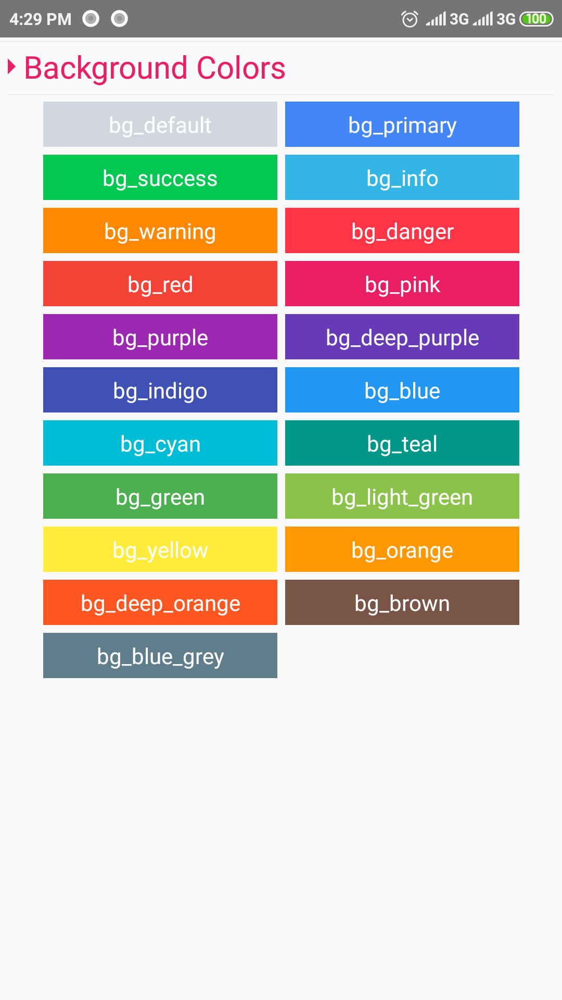
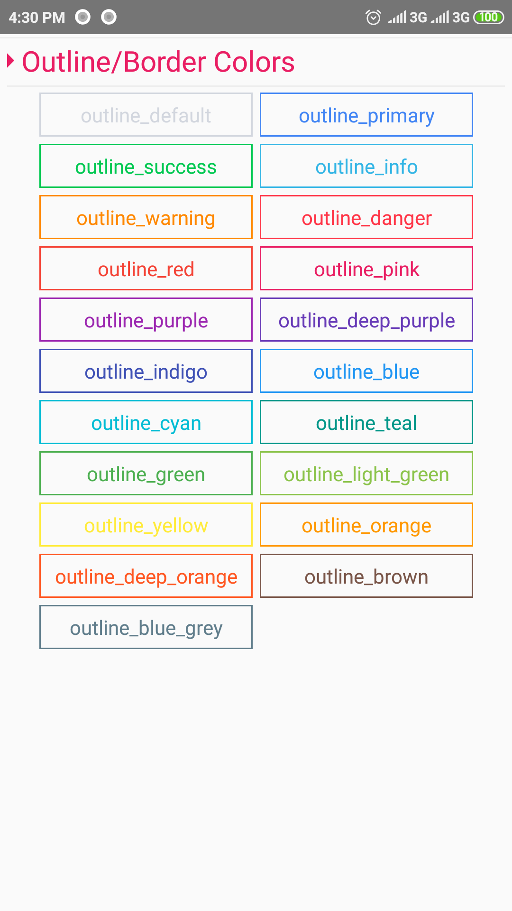
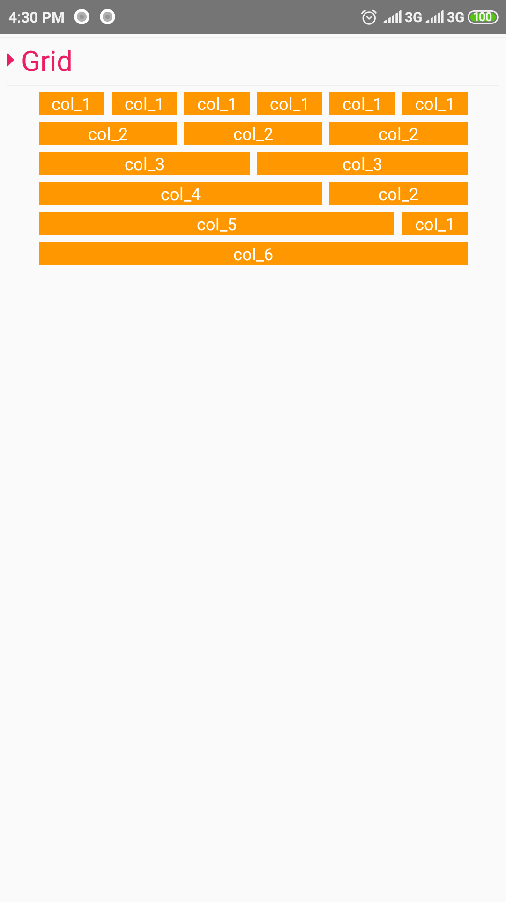
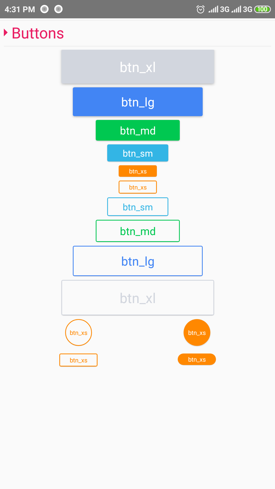
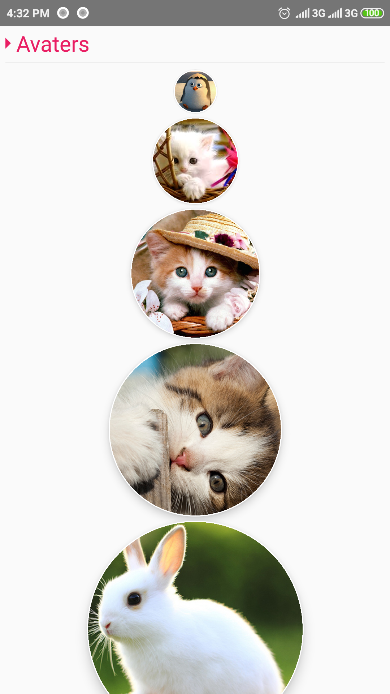
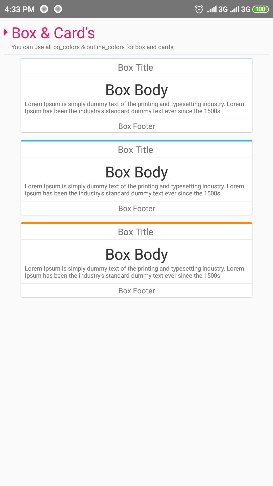
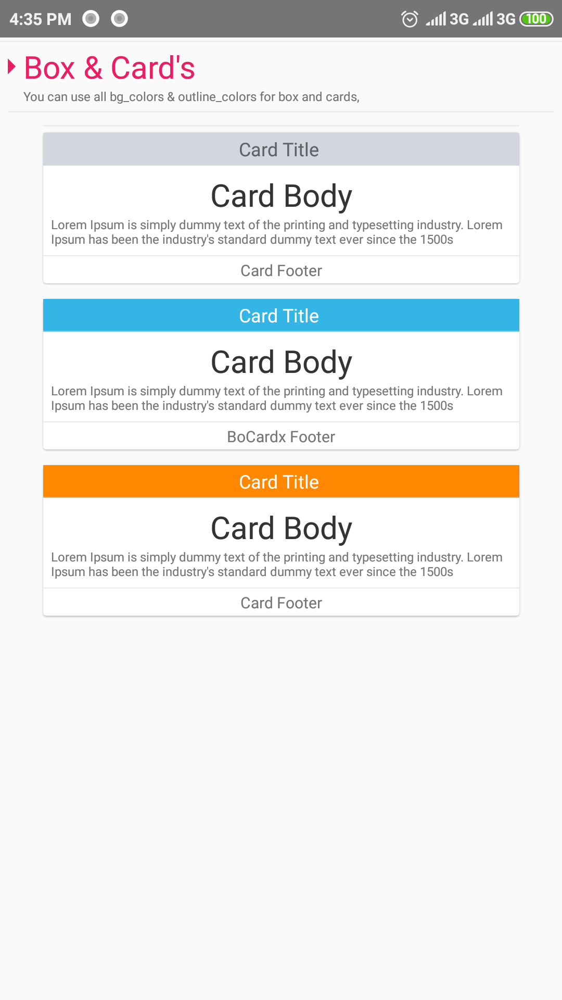
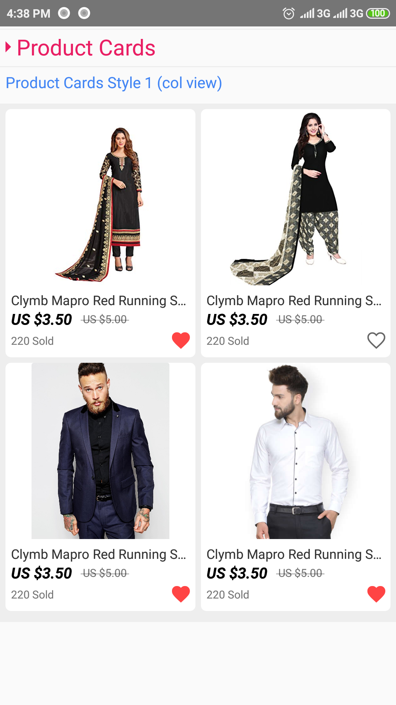
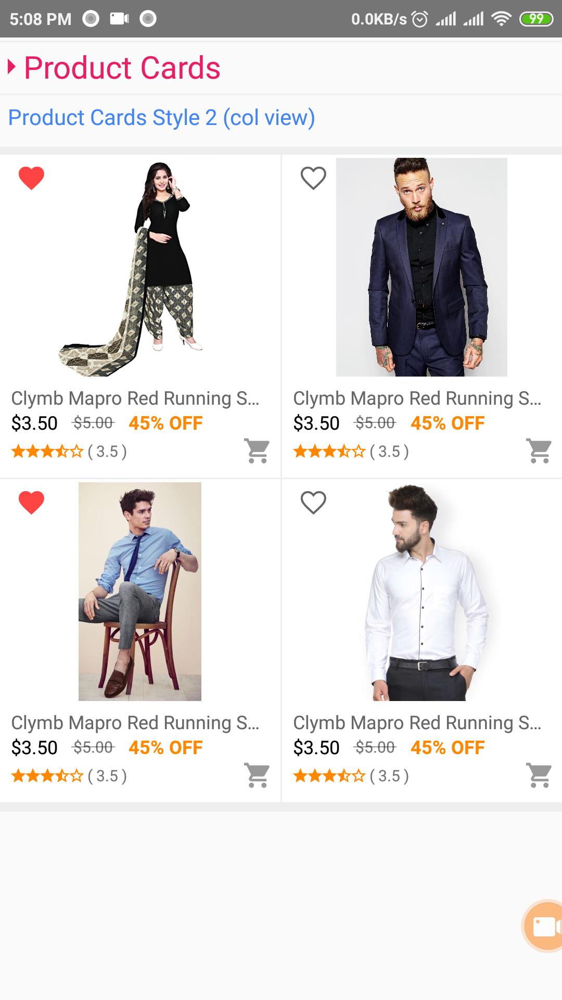

<h3 align="center">
  React Native StyleSheet
</h3>

<p align="center">
  This style sheet help you create new
  <a href="#">react-native</a> app design
</p>
<br />

<!-- ### Installation

Follow
[these instructions](https://react-native-training.github.io/react-native-elements/docs/getting_started.html)
to install React Native Elements! -->
<!-- 
### Usage

Start using the components or try it on Snack
[here](https://snack.expo.io/rJu6gJfBZ). -->


## Components included:

- [Get Started](#get-started)
  - [Typography](#typography)
  - [Text Colors](#text-colors)
  - [Background Colors](#background-colors)
  - [Outline/Border Colors](#outlineborder-colors)
  - [Grid](#grid)
  - [Buttons](#buttons)
  - [Button Colors](#button-colors)
  - [Avaters](#avaters)
  - [Box](#box)
  - [Card](#card)
  - [Product Cards](#product-cards)
    - [Product Cards 1](#product-cards-1)
    - [Product Cards 2](#product-cards-2)
  - [Content Slider](#content-slider)


## Pre Requirements:

To use this styles you need to install some other packages. This packages helps you to make a beautiful design.

  - [npm install react-native-vector-icons --save](https://github.com/oblador/react-native-vector-icons)


## My File Structure
  Before start using this package, You need to know my package file structure, for easily find any file or components.

  * [packageFolder]()
    * [src]()
      * [assets]()
        * [images]()
        * [styles]()
          * [styles.js]()
      * [components]()
        * [Avatars.js]()
        * [BgColors.js]()
        * [Box&Cards.js]()
        * [Buttons.js]()
        * [ContentSlider.js]()
        * [Grid.js]()
        * [OutlineColors.js]()
        * [ProductCards.js]()
        * [TextColors.js]()
        * [Typography.js]()
      * [includes]()
      * [pages]()
        * [index.js]()
      * [README.md]()


# Get Started

## Typography

Example Code:

```js  
import React, {Component} from 'react';
import {
  StyleSheet, 
  Text, 
  View,
  ScrollView,
} from 'react-native';
import css from '../assets/styles/styles'

export default class Typography extends Component{
  render() {
    return (
      <ScrollView
        showsVerticalScrollIndicator={false}>
          <View style={css.container_fluid}>
            <Text style={css.h1}>Heading 1 </Text>
            <Text style={css.h2}>Heading 2 </Text>
            <Text style={css.h3}>Heading 3 </Text>
            <Text style={css.h4}>Heading 4 </Text>
            <Text style={css.h5}>Heading 5 </Text>
            <Text style={css.h6}>Heading 6 </Text>

            <Text style={css.p1}>Paragraph 1 </Text>
            <Text style={css.p2}>Paragraph 2 </Text>
            <Text style={css.p3}>Paragraph 3 </Text>
            <Text style={css.p4}>Paragraph 4 </Text>
            <Text style={css.p5}>Paragraph 5 </Text>

            <Text style={css.small}>Text Small </Text>
          </View>
      </ScrollView>
    );
  }
}
```

Example:
<br>

<p align="center">
  <a href="#" target="_blank"></a>
</p>


## Text Colors

Example Code:

```js  

import React, {Component} from 'react';
import {
  StyleSheet, 
  Text, 
  View,
  ScrollView,
} from 'react-native';
import css from '../assets/styles/styles'

export default class TextColors extends Component{
  render() {
    return (
      <ScrollView
        showsVerticalScrollIndicator={false}>
          <View style={css.container_fluid}>
          <Text style={[css.h6,css.text_default]}> text_default </Text>
              <Text style={[css.h6,css.text_primary]}> text_primary </Text>
              <Text style={[css.h6,css.text_success]}> text_success </Text>
              <Text style={[css.h6,css.text_info]}> text_info </Text>
              <Text style={[css.h6,css.text_warning]}> text_warning </Text>
              <Text style={[css.h6,css.text_danger]}> text_danger </Text>
              <Text style={[css.h6,css.text_red]}> text_red </Text>
              <Text style={[css.h6,css.text_pink]}> text_pink </Text>
              <Text style={[css.h6,css.text_purple]}> text_purple </Text>
              <Text style={[css.h6,css.text_deep_purple]}> text_deep_purple </Text>
              <Text style={[css.h6,css.text_indigo]}> text_indigo </Text>
              <Text style={[css.h6,css.text_blue]}> text_blue </Text>
              <Text style={[css.h6,css.text_cyan]}> text_cyan </Text>
              <Text style={[css.h6,css.text_teal]}> text_teal </Text>
              <Text style={[css.h6,css.text_green]}> text_green </Text>
              <Text style={[css.h6,css.text_light_green]}> text_light_green </Text>
              <Text style={[css.h6,css.text_yellow]}> text_yellow </Text>
              <Text style={[css.h6,css.text_orange]}> text_orange </Text>
              <Text style={[css.h6,css.text_deep_orange]}> text_deep_orange </Text>
              <Text style={[css.h6,css.text_brown]}> text_brown </Text>
              <Text style={[css.h6,css.text_blue_grey]}> text_blue_grey </Text>
          </View>
      </ScrollView>
    );
  }
}

```

Example:
<br>

<p align="center">
  <a href="#" target="_blank"></a>
</p>


## Background Colors

Example Code:

```js  


import React, {Component} from 'react';
import {
  StyleSheet, 
  Text, 
  View,
  ScrollView,
} from 'react-native';
import css from '../assets/styles/styles'

export default class BgColors extends Component{
  render() {
    return (
      <ScrollView
        showsVerticalScrollIndicator={false}>
          <View style={css.container_fluid}>
            <View style={[css.row]}>
                <View style={[css.col_3]}>
                    <View style={[css.bg_default]}>
                        <Text style={[css.text_center,css.text_white,css.pd_5]}>
                            bg_default
                        </Text>
                    </View>
                </View>
                <View style={[css.col_3]}>
                    <View style={[css.bg_primary]}>
                        <Text style={[css.text_center,css.text_white,css.pd_5]}>
                            bg_primary
                        </Text>
                    </View>
                </View>
                <View style={[css.col_3]}>
                    <View style={[css.bg_success]}>
                        <Text style={[css.text_center,css.text_white,css.pd_5]}>
                            bg_success
                        </Text>
                    </View>
                </View>
                <View style={[css.col_3]}>
                    <View style={[css.bg_info]}>
                        <Text style={[css.text_center,css.text_white,css.pd_5]}>
                            bg_info
                        </Text>
                    </View>
                </View>
                <View style={[css.col_3]}>
                    <View style={[css.bg_warning]}>
                        <Text style={[css.text_center,css.text_white,css.pd_5]}>
                            bg_warning
                        </Text>
                    </View>
                </View>
                <View style={[css.col_3]}>
                    <View style={[css.bg_danger]}>
                        <Text style={[css.text_center,css.text_white,css.pd_5]}>
                            bg_danger
                        </Text>
                    </View>
                </View>
                <View style={[css.col_3]}>
                    <View style={[css.bg_red]}>
                        <Text style={[css.text_center,css.text_white,css.pd_5]}>
                            bg_red
                        </Text>
                    </View>
                </View>
                <View style={[css.col_3]}>
                    <View style={[css.bg_pink]}>
                        <Text style={[css.text_center,css.text_white,css.pd_5]}>
                            bg_pink
                        </Text>
                    </View>
                </View>
                <View style={[css.col_3]}>
                    <View style={[css.bg_purple]}>
                        <Text style={[css.text_center,css.text_white,css.pd_5]}>
                            bg_purple
                        </Text>
                    </View>
                </View>
                <View style={[css.col_3]}>
                    <View style={[css.bg_deep_purple]}>
                        <Text style={[css.text_center,css.text_white,css.pd_5]}>
                            bg_deep_purple
                        </Text>
                    </View>
                </View>
                <View style={[css.col_3]}>
                    <View style={[css.bg_indigo]}>
                        <Text style={[css.text_center,css.text_white,css.pd_5]}>
                            bg_indigo
                        </Text>
                    </View>
                </View>
                <View style={[css.col_3]}>
                    <View style={[css.bg_blue]}>
                        <Text style={[css.text_center,css.text_white,css.pd_5]}>
                            bg_blue
                        </Text>
                    </View>
                </View>
                <View style={[css.col_3]}>
                    <View style={[css.bg_cyan]}>
                        <Text style={[css.text_center,css.text_white,css.pd_5]}>
                            bg_cyan
                        </Text>
                    </View>
                </View>
                <View style={[css.col_3]}>
                    <View style={[css.bg_teal]}>
                        <Text style={[css.text_center,css.text_white,css.pd_5]}>
                            bg_teal
                        </Text>
                    </View>
                </View>
                <View style={[css.col_3]}>
                    <View style={[css.bg_green]}>
                        <Text style={[css.text_center,css.text_white,css.pd_5]}>
                            bg_green
                        </Text>
                    </View>
                </View>
                <View style={[css.col_3]}>
                    <View style={[css.bg_light_green]}>
                        <Text style={[css.text_center,css.text_white,css.pd_5]}>
                            bg_light_green
                        </Text>
                    </View>
                </View>
                <View style={[css.col_3]}>
                    <View style={[css.bg_yellow]}>
                        <Text style={[css.text_center,css.text_white,css.pd_5]}>
                            bg_yellow
                        </Text>
                    </View>
                </View>
                <View style={[css.col_3]}>
                    <View style={[css.bg_orange]}>
                        <Text style={[css.text_center,css.text_white,css.pd_5]}>
                            bg_orange
                        </Text>
                    </View>
                </View>
                <View style={[css.col_3]}>
                    <View style={[css.bg_deep_orange]}>
                        <Text style={[css.text_center,css.text_white,css.pd_5]}>
                            bg_deep_orange
                        </Text>
                    </View>
                </View>
                <View style={[css.col_3]}>
                    <View style={[css.bg_brown]}>
                        <Text style={[css.text_center,css.text_white,css.pd_5]}>
                            bg_brown
                        </Text>
                    </View>
                </View>
                <View style={[css.col_3]}>
                    <View style={[css.bg_blue_grey]}>
                        <Text style={[css.text_center,css.text_white,css.pd_5]}>
                            bg_blue_grey
                        </Text>
                    </View>
                </View>
            </View>
          </View>
      </ScrollView>
    );
  }
}
```

Example:
<br>

<p align="center">
  <a href="#" target="_blank"></a>
</p>

## Outline/Border Colors

Example Code:

```js  

import React, {Component} from 'react';
import {
  StyleSheet, 
  Text, 
  View,
  ScrollView,
} from 'react-native';
import css from '../assets/styles/styles'

export default class OutlineColors extends Component{
  render() {
    return (
      <ScrollView
        showsVerticalScrollIndicator={false}>
          <View style={css.container_fluid}>
            <View style={[css.row]}>
                <View style={[css.col_3]}>
                    <View style={[css.outline_1,css.outline_default]}>
                        <Text style={[css.text_center,css.text_default,css.pd_5]}>
                            outline_default
                        </Text>
                    </View>
                </View>
                <View style={[css.col_3]}>
                    <View style={[css.outline_1,css.outline_primary]}>
                        <Text style={[css.text_center,css.text_primary,css.pd_5]}>
                            outline_primary
                        </Text>
                    </View>
                </View>
                <View style={[css.col_3]}>
                    <View style={[css.outline_1,css.outline_success]}>
                        <Text style={[css.text_center,css.text_success,css.pd_5]}>
                            outline_success
                        </Text>
                    </View>
                </View>
                <View style={[css.col_3]}>
                    <View style={[css.outline_1,css.outline_info]}>
                        <Text style={[css.text_center,css.text_info,css.pd_5]}>
                            outline_info
                        </Text>
                    </View>
                </View>
                <View style={[css.col_3]}>
                    <View style={[css.outline_1,css.outline_warning]}>
                        <Text style={[css.text_center,css.text_warning,css.pd_5]}>
                            outline_warning
                        </Text>
                    </View>
                </View>
                <View style={[css.col_3]}>
                    <View style={[css.outline_1,css.outline_danger]}>
                        <Text style={[css.text_center,css.text_danger,css.pd_5]}>
                            outline_danger
                        </Text>
                    </View>
                </View>
                <View style={[css.col_3]}>
                    <View style={[css.outline_1,css.outline_red]}>
                        <Text style={[css.text_center,css.text_red,css.pd_5]}>
                            outline_red
                        </Text>
                    </View>
                </View>
                <View style={[css.col_3]}>
                    <View style={[css.outline_1,css.outline_pink]}>
                        <Text style={[css.text_center,css.text_pink,css.pd_5]}>
                            outline_pink
                        </Text>
                    </View>
                </View>
                <View style={[css.col_3]}>
                    <View style={[css.outline_1,css.outline_purple]}>
                        <Text style={[css.text_center,css.text_purple,css.pd_5]}>
                            outline_purple
                        </Text>
                    </View>
                </View>
                <View style={[css.col_3]}>
                    <View style={[css.outline_1,css.outline_deep_purple]}>
                        <Text style={[css.text_center,css.text_deep_purple,css.pd_5]}>
                            outline_deep_purple
                        </Text>
                    </View>
                </View>
                <View style={[css.col_3]}>
                    <View style={[css.outline_1,css.outline_indigo]}>
                        <Text style={[css.text_center,css.text_indigo,css.pd_5]}>
                            outline_indigo
                        </Text>
                    </View>
                </View>
                <View style={[css.col_3]}>
                    <View style={[css.outline_1,css.outline_blue]}>
                        <Text style={[css.text_center,css.text_blue,css.pd_5]}>
                            outline_blue
                        </Text>
                    </View>
                </View>
                <View style={[css.col_3]}>
                    <View style={[css.outline_1,css.outline_cyan]}>
                        <Text style={[css.text_center,css.text_cyan,css.pd_5]}>
                            outline_cyan
                        </Text>
                    </View>
                </View>
                <View style={[css.col_3]}>
                    <View style={[css.outline_1,css.outline_teal]}>
                        <Text style={[css.text_center,css.text_teal,css.pd_5]}>
                            outline_teal
                        </Text>
                    </View>
                </View>
                <View style={[css.col_3]}>
                    <View style={[css.outline_1,css.outline_green]}>
                        <Text style={[css.text_center,css.text_green,css.pd_5]}>
                            outline_green
                        </Text>
                    </View>
                </View>
                <View style={[css.col_3]}>
                    <View style={[css.outline_1,css.outline_light_green]}>
                        <Text style={[css.text_center,css.text_light_green,css.pd_5]}>
                            outline_light_green
                        </Text>
                    </View>
                </View>
                <View style={[css.col_3]}>
                    <View style={[css.outline_1,css.outline_yellow]}>
                        <Text style={[css.text_center,css.text_yellow,css.pd_5]}>
                            outline_yellow
                        </Text>
                    </View>
                </View>
                <View style={[css.col_3]}>
                    <View style={[css.outline_1,css.outline_orange]}>
                        <Text style={[css.text_center,css.text_orange,css.pd_5]}>
                            outline_orange
                        </Text>
                    </View>
                </View>
                <View style={[css.col_3]}>
                    <View style={[css.outline_1,css.outline_deep_orange]}>
                        <Text style={[css.text_center,css.text_deep_orange,css.pd_5]}>
                            outline_deep_orange
                        </Text>
                    </View>
                </View>
                <View style={[css.col_3]}>
                    <View style={[css.outline_1,css.outline_brown]}>
                        <Text style={[css.text_center,css.text_brown,css.pd_5]}>
                            outline_brown
                        </Text>
                    </View>
                </View>
                <View style={[css.col_3]}>
                    <View style={[css.outline_1,css.outline_blue_grey]}>
                        <Text style={[css.text_center,css.text_blue_grey,css.pd_5]}>
                            outline_blue_grey
                        </Text>
                    </View>
                </View>
            </View>
          </View>
      </ScrollView>
    );
  }
}

```

Example:
<br>

<p align="center">
  <a href="#" target="_blank"></a>
</p>


Click [here](https://react-native-training.github.io/react-native-elements/blog/2018/12/13/react-native-web.html) for a full walkthrough using React Native Elements + React Native Web.


## Grid

Example Code:

```js  

import React, {Component} from 'react';
import {
  StyleSheet, 
  Text, 
  View,
  ScrollView,
} from 'react-native';
import css from '../assets/styles/styles'

export default class Grid extends Component{
  render() {
    return (
      <ScrollView
        showsVerticalScrollIndicator={false}>
          <View style={css.container_fluid}>
              <View style={css.row}>
                <View style={css.col_1}>
                  <View style={css.bg_orange}>
                    <Text style={[css.p4,css.text_center,css.text_white]}>
                        col_1
                    </Text>
                  </View>
                </View>
                <View style={css.col_1}>
                  <View style={css.bg_orange}>
                    <Text style={[css.p4,css.text_center,css.text_white]}>
                        col_1
                    </Text>
                  </View>
                </View>
                <View style={css.col_1}>
                  <View style={css.bg_orange}>
                    <Text style={[css.p4,css.text_center,css.text_white]}>
                        col_1
                    </Text>
                  </View>
                </View>
                <View style={css.col_1}>
                  <View style={css.bg_orange}>
                    <Text style={[css.p4,css.text_center,css.text_white]}>
                        col_1
                    </Text>
                  </View>
                </View>
                <View style={css.col_1}>
                  <View style={css.bg_orange}>
                    <Text style={[css.p4,css.text_center,css.text_white]}>
                        col_1
                    </Text>
                  </View>
                </View>
                <View style={css.col_1}>
                  <View style={css.bg_orange}>
                    <Text style={[css.p4,css.text_center,css.text_white]}>
                        col_1
                    </Text>
                  </View>
                </View>
                

                <View style={css.col_2}>
                  <View style={css.bg_orange}>
                    <Text style={[css.p4,css.text_center,css.text_white]}>
                        col_2
                    </Text>
                  </View>
                </View>
                <View style={css.col_2}>
                  <View style={css.bg_orange}>
                    <Text style={[css.p4,css.text_center,css.text_white]}>
                        col_2
                    </Text>
                  </View>
                </View>
                <View style={css.col_2}>
                  <View style={css.bg_orange}>
                    <Text style={[css.p4,css.text_center,css.text_white]}>
                        col_2
                    </Text>
                  </View>
                </View>


                <View style={css.col_3}>
                  <View style={css.bg_orange}>
                    <Text style={[css.p4,css.text_center,css.text_white]}>
                        col_3
                    </Text>
                  </View>
                </View>
                <View style={css.col_3}>
                  <View style={css.bg_orange}>
                    <Text style={[css.p4,css.text_center,css.text_white]}>
                        col_3
                    </Text>
                  </View>
                </View>

                <View style={css.col_4}>
                  <View style={css.bg_orange}>
                    <Text style={[css.p4,css.text_center,css.text_white]}>
                        col_4
                    </Text>
                  </View>
                </View>
                <View style={css.col_2}>
                  <View style={css.bg_orange}>
                    <Text style={[css.p4,css.text_center,css.text_white]}>
                        col_2
                    </Text>
                  </View>
                </View>

                <View style={css.col_5}>
                  <View style={css.bg_orange}>
                    <Text style={[css.p4,css.text_center,css.text_white]}>
                        col_5
                    </Text>
                  </View>
                </View>
                <View style={css.col_1}>
                  <View style={css.bg_orange}>
                    <Text style={[css.p4,css.text_center,css.text_white]}>
                        col_1
                    </Text>
                  </View>
                </View>

                <View style={css.col_6}>
                  <View style={css.bg_orange}>
                    <Text style={[css.p4,css.text_center,css.text_white]}>
                        col_6
                    </Text>
                  </View>
                </View>
              </View>  
          </View>
      </ScrollView>
    );
  }
}
```

Example:
<br>

<p align="center">
  <a href="#" target="_blank"></a>
</p>


## Buttons

Example Code:

```js  

import React, {Component} from 'react';
import {
  StyleSheet, 
  Text, 
  View,
  ScrollView,
  TouchableOpacity
} from 'react-native';
import css from '../assets/styles/styles'

export default class Buttons extends Component{
  render() {
    return (
      <ScrollView
        showsVerticalScrollIndicator={false}>
          <View style={css.container_fluid}>
          <TouchableOpacity style={[css.bg_default,css.btn_xl,css.selfCenter,css.mb_5]}>
                <Text style={[css.text_center,css.text_white,css.p1]}> btn_xl </Text>
              </TouchableOpacity>

              <TouchableOpacity style={[css.bg_primary,css.btn_lg,css.selfCenter,css.mb_5]}>
                <Text style={[css.text_center,css.text_white,css.p2]}> btn_lg </Text>
              </TouchableOpacity>
              
              <TouchableOpacity style={[css.bg_success,css.btn_md,css.selfCenter,css.mb_5]}>
                <Text style={[css.text_center,css.text_white,css.p3]}> btn_md </Text>
              </TouchableOpacity>
              
              <TouchableOpacity style={[css.bg_info,css.btn_sm,css.selfCenter,css.mb_5]}>
                <Text style={[css.text_center,css.text_white,css.p4]}> btn_sm </Text>
              </TouchableOpacity>
              
              <TouchableOpacity style={[css.bg_warning,css.btn_xs,css.selfCenter,css.mb_5]}>
                <Text style={[css.text_center,css.text_white,css.small]}> btn_xs </Text>
              </TouchableOpacity>

          {/* Buttons Outline */}
              
              <TouchableOpacity style={[css.outline_warning,css.btn_xs_outline,css.selfCenter,css.mb_5]}>
                <Text style={[css.text_center,css.warning_text,css.small,css.text_warning]}> btn_xs </Text>
              </TouchableOpacity>
              
              <TouchableOpacity style={[css.outline_info,css.btn_sm_outline,css.selfCenter,css.mb_5]}>
                <Text style={[css.text_center,css.info_text,css.p4,css.text_info]}> btn_sm </Text>
              </TouchableOpacity>
              
              <TouchableOpacity style={[css.outline_success,css.btn_md_outline,css.selfCenter,css.mb_5]}>
                <Text style={[css.text_center,css.success_text,css.p3,css.text_success]}> btn_md </Text>
              </TouchableOpacity>

              <TouchableOpacity style={[css.outline_primary,css.btn_lg_outline,css.selfCenter,css.mb_5]}>
                <Text style={[css.text_center,css.primary_text,css.p2,css.text_primary]}> btn_lg </Text>
              </TouchableOpacity>

              <TouchableOpacity style={[css.outline_default,css.btn_xl_outline,css.selfCenter,css.mb_5]}>
                <Text style={[css.text_center,css.default_text,css.p1,css.text_default]}> btn_xl </Text>
              </TouchableOpacity>

              {/* Buttons Round Outline */}
              
              <View style={css.row}>
                <View style={css.col_3}>
                  <TouchableOpacity style={[css.outline_warning,css.btn_xs_round_outline,css.selfCenter,css.mb_5]}>
                    <Text style={[css.text_center,css.text_warning,css.small]}> btn_xs </Text>
                  </TouchableOpacity>
                </View>
                <View style={css.col_3}>
                  <TouchableOpacity style={[css.bg_warning,css.btn_xs_round,css.selfCenter,css.mb_5]}>
                    <Text style={[css.text_center,css.text_white,css.small]}> btn_xs </Text>
                  </TouchableOpacity>
                </View>
              </View>

              <View style={css.row}>
                <View style={css.col_3}>
                  <TouchableOpacity style={[css.outline_warning,css.btn_xs_outline,css.selfCenter,css.mb_5]}>
                    <Text style={[css.text_center,css.text_warning,css.small]}> btn_xs </Text>
                  </TouchableOpacity>
                </View>
                <View style={css.col_3}>
                  <TouchableOpacity style={[css.bg_warning,css.btn_xs,css.btn_pill,css.selfCenter,css.mb_5]}>
                    <Text style={[css.text_center,css.text_white,css.small]}> btn_xs </Text>
                  </TouchableOpacity>
                </View>
              </View> 
          </View>
      </ScrollView>
    );
  }
}
```

Example:
<br>

<p align="center">
  <a href="#" target="_blank"></a>
</p>


## Button Colors

Example Code:You want to use button background color, You can use all bg_colors. And outline color,You can use all outline_colors.


## Avaters

Example Code:

```js  
import React, {Component} from 'react';
import {
  StyleSheet, 
  View,
  ScrollView,
  Image,
} from 'react-native';
import css from '../assets/styles/styles'

export default class Avatars extends Component{
  render() {
    return (
      <ScrollView
        showsVerticalScrollIndicator={false}>
          <View style={css.container_fluid}>
            <View style={[css.avatar_xs,css.selfCenter]}>
                <Image 
                source={require('../assets/images/5.gif')}
                style={css.avatar_img}/>
              </View>

              <View style={[css.avatar_sm,css.selfCenter]}>
                <Image 
                source={require('../assets/images/4.jpeg')}
                style={css.avatar_img}/>
              </View>

              <View style={[css.avatar_md,css.selfCenter]}>
                <Image 
                source={require('../assets/images/3.jpg')}
                style={css.avatar_img}/>
              </View>

              <View style={[css.avatar_lg,css.selfCenter]}>
                <Image 
                source={require('../assets/images/2.jpg')}
                style={css.avatar_img}/>
              </View>

              <View style={[css.avatar_xl,css.selfCenter]}>
                <Image 
                source={require('../assets/images/1.jpg')}
                style={css.avatar_img}/>
              </View> 
          </View>
      </ScrollView>
    );
  }
}

```

Example:
<br>

<p align="center">
  <a href="#" target="_blank"></a>
</p>


## Box

Example Code:

```js  
import React, {Component} from 'react';
import {
  StyleSheet, 
  View,
  ScrollView,
  Text,
} from 'react-native';
import css from '../assets/styles/styles'

export default class BoxAndCards extends Component{
  render() {
    return (
      <ScrollView
        showsVerticalScrollIndicator={false}>
          <View style={css.container_fluid}>
              <View style={[css.box,css.box_default,css.mb_10]}>
                <View style={[css.box_header]}>
                  <Text style={[css.box_title,css.text_center]}>Box Title </Text>
                </View>
                <View style={css.box_body}>
                  <Text style={[css.text_center,css.h5]}>Box Body</Text>
                  <Text style={css.small}>
                    Lorem Ipsum is simply dummy text of 
                    the printing and typesetting industry. 
                    Lorem Ipsum has been the industry's standard 
                    dummy text ever since the 1500s
                  </Text>
                </View>
                <View style={css.box_footer}>
                  <Text style={[css.p5,css.text_center]}>Box Footer</Text>
                </View>
              </View>

              <View style={[css.box,css.box_info,css.mb_10]}>
                <View style={[css.box_header]}>
                  <Text style={[css.box_title,css.text_center]}>Box Title </Text>
                </View>
                <View style={css.box_body}>
                  <Text style={[css.text_center,css.h5]}>Box Body</Text>
                  <Text style={css.small}>
                    Lorem Ipsum is simply dummy text of 
                    the printing and typesetting industry. 
                    Lorem Ipsum has been the industry's standard 
                    dummy text ever since the 1500s
                  </Text>
                </View>
                <View style={css.box_footer}>
                  <Text style={[css.p5,css.text_center]}>Box Footer</Text>
                </View>
              </View>

              <View style={[css.box,css.box_warning,css.mb_10]}>
                <View style={[css.box_header]}>
                  <Text style={[css.box_title,css.text_center]}>Box Title </Text>
                </View>
                <View style={css.box_body}>
                  <Text style={[css.text_center,css.h5]}>Box Body</Text>
                  <Text style={css.small}>
                    Lorem Ipsum is simply dummy text of 
                    the printing and typesetting industry. 
                    Lorem Ipsum has been the industry's standard 
                    dummy text ever since the 1500s
                  </Text>
                </View>
                <View style={css.box_footer}>
                  <Text style={[css.p5,css.text_center]}>Box Footer</Text>
                </View>
              </View>
          </View>
      </ScrollView>
    );
  }
}

```

Example:
<br>

<p align="center">
  <a href="#" target="_blank"></a>
</p>


## Card

Example Code:

```js  
import React, {Component} from 'react';
import {
  StyleSheet, 
  View,
  ScrollView,
  Text,
} from 'react-native';
import css from '../assets/styles/styles'

export default class BoxAndCards extends Component{
  render() {
    return (
      <ScrollView
        showsVerticalScrollIndicator={false}>
          <View style={css.container_fluid}>
              <View style={[css.box,css.mb_10]}>
                <View style={[css.box_header,css.bg_default]}>
                  <Text style={[css.box_title,css.text_center]}>Card Title </Text>
                </View>
                <View style={css.box_body}>
                  <Text style={[css.text_center,css.h5]}>Card Body</Text>
                  <Text style={css.small}>
                    Lorem Ipsum is simply dummy text of 
                    the printing and typesetting industry. 
                    Lorem Ipsum has been the industry's standard 
                    dummy text ever since the 1500s
                  </Text>
                </View>
                <View style={css.box_footer}>
                  <Text style={[css.p5,css.text_center]}>Card Footer</Text>
                </View>
              </View>

              <View style={[css.box,css.mb_10]}>
                <View style={[css.box_header,css.bg_info]}>
                  <Text style={[css.box_title,css.text_center,css.text_white]}>Card Title </Text>
                </View>
                <View style={css.box_body}>
                  <Text style={[css.text_center,css.h5]}>Card Body</Text>
                  <Text style={css.small}>
                    Lorem Ipsum is simply dummy text of 
                    the printing and typesetting industry. 
                    Lorem Ipsum has been the industry's standard 
                    dummy text ever since the 1500s
                  </Text>
                </View>
                <View style={css.box_footer}>
                  <Text style={[css.p5,css.text_center]}>BoCardx Footer</Text>
                </View>
              </View>

              <View style={[css.box,css.mb_10]}>
                <View style={[css.box_header,css.bg_warning]}>
                  <Text style={[css.box_title,css.text_center,css.text_white]}>Card Title </Text>
                </View>
                <View style={css.box_body}>
                  <Text style={[css.text_center,css.h5]}>Card Body</Text>
                  <Text style={css.small}>
                    Lorem Ipsum is simply dummy text of 
                    the printing and typesetting industry. 
                    Lorem Ipsum has been the industry's standard 
                    dummy text ever since the 1500s
                  </Text>
                </View>
                <View style={css.box_footer}>
                  <Text style={[css.p5,css.text_center]}>Card Footer</Text>
                </View>
              </View>
          </View>
      </ScrollView>
    );
  }
}

```

Example:
<br>

<p align="center">
  <a href="#" target="_blank"></a>
</p>


## Product Cards

### Product Cards 1
Example Code (Horizontal ScrollView):

```js
import React, {Component} from 'react';
import {
  StyleSheet, 
  View,
  ScrollView,
  Text,
  Image,
  TouchableOpacity
} from 'react-native';
import css from '../assets/styles/styles'
import Icon from 'react-native-vector-icons/Ionicons';

export default class ProductCards extends Component{
  render() {
    return (
      <ScrollView
        showsVerticalScrollIndicator={false}>
          {/* product 1 */}
          <Text style={[css.text_primary,css.p3,css.pdl_5,css.mb_5]}>
            Product Cards Style 1 (Horizontal ScrollView)
          </Text>
          <View style={[css.pdt_10,css.pdb_10,css.mb_10,{backgroundColor:'#eee'}]}>
              
              <ScrollView
              style={[css.scrollViewHorizontal]}
              horizontal={true}
              showsHorizontalScrollIndicator={false}>
                <View style={[css.single_product_1]}>
                  <View style={css.p_card_1}>
                    <TouchableOpacity style={css.p_card_1_body}>
                      <View style={css.p_card_1_image_box}>
                        <Image 
                          style={css.p_card_1_image}
                          source={require('../assets/images/d5.jpg')}/>
                      </View>
                      <View style={css.p_card_1_details}>
                        <Text
                          numberOfLines={1}
                          ellipsizeMode={'tail'}
                          style={css.p_card_1_name}>
                            Clymb Mapro Red Running Sports Shoes For Men's In Various Sizes
                        </Text>
                        <View style={[css.p_card_1_price_box]}>
                          <Text style={[css.p_card_1_price]}>
                            US $3.50
                          </Text>
                          <View style={css.ml_10}>
                            <View style={[css.old_price_border]}/>
                            <Text style={[css.p_card_1_old_price]}>
                                US $5.00
                            </Text>
                          </View>
                        </View>
                      </View>
                    </TouchableOpacity>
                    <View style={[css.p_card_1_footer]}>
                      <Text style={[css.p5]}>
                        220 Sold
                      </Text>
                      <TouchableOpacity>
                        {/* <Icon name="md-heart-empty" color="#666" size={20}/> */}
                        <Icon name="md-heart" color="#ff4444" size={20}/>
                      </TouchableOpacity>
                    </View>
                  </View>
                </View>
                <View style={[css.single_product_1]}>
                  <View style={css.p_card_1}>
                    <TouchableOpacity style={css.p_card_1_body}>
                      <View style={css.p_card_1_image_box}>
                        <Image 
                          style={css.p_card_1_image}
                          source={require('../assets/images/d5.jpg')}/>
                      </View>
                      <View style={css.p_card_1_details}>
                        <Text
                          numberOfLines={1}
                          ellipsizeMode={'tail'}
                          style={css.p_card_1_name}>
                            Clymb Mapro Red Running Sports Shoes For Men's In Various Sizes
                        </Text>
                        <View style={[css.p_card_1_price_box]}>
                          <Text style={[css.p_card_1_price]}>
                            US $3.50
                          </Text>
                          <View style={css.ml_10}>
                            <View style={[css.old_price_border]}/>
                            <Text style={[css.p_card_1_old_price]}>
                                US $5.00
                            </Text>
                          </View>
                        </View>
                      </View>
                    </TouchableOpacity>
                    <View style={[css.p_card_1_footer]}>
                      <Text style={[css.p5]}>
                        220 Sold
                      </Text>
                      <TouchableOpacity>
                        {/* <Icon name="md-heart-empty" color="#666" size={20}/> */}
                        <Icon name="md-heart" color="#ff4444" size={20}/>
                      </TouchableOpacity>
                    </View>
                  </View>
                </View>
                <View style={[css.single_product_1]}>
                  <View style={css.p_card_1}>
                    <TouchableOpacity style={css.p_card_1_body}>
                      <View style={css.p_card_1_image_box}>
                        <Image 
                          style={css.p_card_1_image}
                          source={require('../assets/images/d5.jpg')}/>
                      </View>
                      <View style={css.p_card_1_details}>
                        <Text
                          numberOfLines={1}
                          ellipsizeMode={'tail'}
                          style={css.p_card_1_name}>
                            Clymb Mapro Red Running Sports Shoes For Men's In Various Sizes
                        </Text>
                        <View style={[css.p_card_1_price_box]}>
                          <Text style={[css.p_card_1_price]}>
                            US $3.50
                          </Text>
                          <View style={css.ml_10}>
                            <View style={[css.old_price_border]}/>
                            <Text style={[css.p_card_1_old_price]}>
                                US $5.00
                            </Text>
                          </View>
                        </View>
                      </View>
                    </TouchableOpacity>
                    <View style={[css.p_card_1_footer]}>
                      <Text style={[css.p5]}>
                        220 Sold
                      </Text>
                      <TouchableOpacity>
                        {/* <Icon name="md-heart-empty" color="#666" size={20}/> */}
                        <Icon name="md-heart" color="#ff4444" size={20}/>
                      </TouchableOpacity>
                    </View>
                  </View>
                </View>
            </ScrollView>
          </View>
      </ScrollView>
    );
  }
}
```

Example:
<br>

<p align="center">
  <a href="#" target="_blank"></a>
</p>

Example Code (Grid View):

```js
import React, {Component} from 'react';
import {
  StyleSheet, 
  View,
  ScrollView,
  Text,
  Image,
  TouchableOpacity
} from 'react-native';
import css from '../assets/styles/styles'
import Icon from 'react-native-vector-icons/Ionicons';

export default class ProductCards extends Component{
  render() {
    return (
      <ScrollView
        showsVerticalScrollIndicator={false}>
          {/* product 1 */}
          <Text style={[css.text_primary,css.p3,css.pdl_5,css.pdb_10]}>
            Product Cards Style 1 (Grid view)
          </Text>
          <View style={[css.pd_5,css.mb_10,{backgroundColor:'#eee'}]}>

              <View style={css.row}>
                <View style={css.col_3}>
                  <View style={css.p_card_1}>
                    <TouchableOpacity style={css.p_card_1_body}>
                      <View style={css.p_card_1_image_box}>
                        <Image 
                          style={css.p_card_1_image}
                          source={require('../assets/images/d1.jpg')}/>
                      </View>
                      <View style={css.p_card_1_details}>
                        <Text
                          numberOfLines={1}
                          ellipsizeMode={'tail'}
                          style={css.p_card_1_name}>
                            Clymb Mapro Red Running Sports Shoes For Men's In Various Sizes
                        </Text>
                        <View style={[css.p_card_1_price_box]}>
                          <Text style={[css.p_card_1_price]}>
                            US $3.50
                          </Text>
                          <View style={css.ml_10}>
                            <View style={[css.old_price_border]}/>
                            <Text style={[css.p_card_1_old_price]}>
                                US $5.00
                            </Text>
                          </View>
                        </View>
                      </View>
                    </TouchableOpacity>
                    <View style={[css.p_card_1_footer]}>
                      <Text style={[css.p5]}>
                        220 Sold
                      </Text>
                      <TouchableOpacity>
                        {/* <Icon name="md-heart-empty" color="#666" size={20}/> */}
                        <Icon name="md-heart" color="#ff4444" size={20}/>
                      </TouchableOpacity>
                    </View>
                  </View>
                </View>

                <View style={css.col_3}>
                  <View style={css.p_card_1}>
                    <TouchableOpacity style={css.p_card_1_body}>
                      <View style={css.p_card_1_image_box}>
                        <Image 
                          style={css.p_card_1_image}
                          source={require('../assets/images/d2.jpg')}/>
                      </View>
                      <View style={css.p_card_1_details}>
                        <Text
                          numberOfLines={1}
                          ellipsizeMode={'tail'}
                          style={css.p_card_1_name}>
                            Clymb Mapro Red Running Sports Shoes For Men's In Various Sizes
                        </Text>
                        <View style={[css.p_card_1_price_box]}>
                          <Text style={[css.p_card_1_price]}>
                            US $3.50
                          </Text>
                          <View style={css.ml_10}>
                            <View style={[css.old_price_border]}/>
                            <Text style={[css.p_card_1_old_price]}>
                                US $5.00
                            </Text>
                          </View>
                        </View>
                      </View>
                    </TouchableOpacity>
                    <View style={[css.p_card_1_footer]}>
                      <Text style={[css.p5]}>
                        220 Sold
                      </Text>
                      <TouchableOpacity>
                        <Icon name="md-heart-empty" color="#666" size={20}/>
                        {/* <Icon name="md-heart" color="#ff4444" size={20}/> */}
                      </TouchableOpacity>
                    </View>
                  </View>
                </View>

                <View style={css.col_3}>
                  <View style={css.p_card_1}>
                    <TouchableOpacity style={css.p_card_1_body}>
                      <View style={css.p_card_1_image_box}>
                        <Image 
                          style={css.p_card_1_image}
                          source={require('../assets/images/d3.jpg')}/>
                      </View>
                      <View style={css.p_card_1_details}>
                        <Text
                          numberOfLines={1}
                          ellipsizeMode={'tail'}
                          style={css.p_card_1_name}>
                            Clymb Mapro Red Running Sports Shoes For Men's In Various Sizes
                        </Text>
                        <View style={[css.p_card_1_price_box]}>
                          <Text style={[css.p_card_1_price]}>
                            US $3.50
                          </Text>
                          <View style={css.ml_10}>
                            <View style={[css.old_price_border]}/>
                            <Text style={[css.p_card_1_old_price]}>
                                US $5.00
                            </Text>
                          </View>
                        </View>
                      </View>
                    </TouchableOpacity>
                    <View style={[css.p_card_1_footer]}>
                      <Text style={[css.p5]}>
                        220 Sold
                      </Text>
                      <TouchableOpacity>
                        {/* <Icon name="md-heart-empty" color="#666" size={20}/> */}
                        <Icon name="md-heart" color="#ff4444" size={20}/>
                      </TouchableOpacity>
                    </View>
                  </View>
                </View>

                <View style={css.col_3}>
                  <View style={css.p_card_1}>
                    <TouchableOpacity style={css.p_card_1_body}>
                      <View style={css.p_card_1_image_box}>
                        <Image 
                          style={css.p_card_1_image}
                          source={require('../assets/images/d5.jpg')}/>
                      </View>
                      <View style={css.p_card_1_details}>
                        <Text
                          numberOfLines={1}
                          ellipsizeMode={'tail'}
                          style={css.p_card_1_name}>
                            Clymb Mapro Red Running Sports Shoes For Men's In Various Sizes
                        </Text>
                        <View style={[css.p_card_1_price_box]}>
                          <Text style={[css.p_card_1_price]}>
                            US $3.50
                          </Text>
                          <View style={css.ml_10}>
                            <View style={[css.old_price_border]}/>
                            <Text style={[css.p_card_1_old_price]}>
                                US $5.00
                            </Text>
                          </View>
                        </View>
                      </View>
                    </TouchableOpacity>
                    <View style={[css.p_card_1_footer]}>
                      <Text style={[css.p5]}>
                        220 Sold
                      </Text>
                      <TouchableOpacity>
                        {/* <Icon name="md-heart-empty" color="#666" size={20}/> */}
                        <Icon name="md-heart" color="#ff4444" size={20}/>
                      </TouchableOpacity>
                    </View>
                  </View>
                </View>
              </View>
          </View>
      </ScrollView>
    );
  }
}
```

Example:
<br>

<p align="center">
  <a href="#" target="_blank"></a>
</p>


### Product Cards 2
Example Code (Horizontal ScrollView):

```js
import React, {Component} from 'react';
import {
  StyleSheet, 
  View,
  ScrollView,
  Text,
  Image,
  TouchableOpacity
} from 'react-native';
import css from '../assets/styles/styles'
import Icon from 'react-native-vector-icons/Ionicons';

export default class ProductCards extends Component{
  render() {
    return (
      <ScrollView
        showsVerticalScrollIndicator={false}>
          {/* product 2 */}
          <Text style={[css.text_primary,css.p3,css.pdl_5,css.pdb_10]}>
            Product Cards Style 2 (Horizontal ScrollView)
          </Text>
          <View style={[css.pdt_5,css.pdb_5,css.mb_10,{backgroundColor:'#eee'}]}>
            <ScrollView
              horizontal={true}
              showsHorizontalScrollIndicator={false}>
                <View style={[css.single_product_2]}>
                  <View style={css.p_card_2}>
                    <TouchableOpacity style={[css.p_card_2_heart_icon]}>
                      {/* <Icon name="md-heart" color="#ff4444" size={20}/> */}
                        <Icon name="md-heart-empty" color="#666" size={20}/>
                    </TouchableOpacity>
                    <TouchableOpacity style={css.p_card_2_body}>
                      <View style={css.p_card_2_image_box}>
                        <Image 
                          style={css.p_card_2_image}
                          source={require('../assets/images/d5.jpg')}/>
                      </View>
                      <View style={css.p_card_1_details}>
                        <Text
                          numberOfLines={1}
                          ellipsizeMode={'tail'}
                          style={css.p_card_2_name}>
                            Clymb Mapro Red Running Sports Shoes For Men's In Various Sizes
                        </Text>
                        <View style={[css.p_card_2_price_box]}>
                          <Text style={[css.p_card_2_price]}>
                            $3.50
                          </Text>
                          <View style={css.ml_10}>
                            <View style={[css.old_price_border]}/>
                            <Text style={[css.p_card_2_old_price]}>
                              $5.00
                            </Text>
                          </View>
                          <Text style={[css.p_card_2_discount]}>
                              45% OFF
                            </Text>
                        </View>
                      </View>
                    </TouchableOpacity>
                    <View style={[css.p_card_2_footer]}>
                      <View style={[css.rating_star]}>
                        <Icon name="md-star" color="#FF8800" size={12}/>
                        <Icon name="md-star" color="#FF8800" size={12}/>
                        <Icon name="md-star" color="#FF8800" size={12}/>
                        <Icon name="md-star-half" color="#FF8800" size={12}/>
                        <Icon name="md-star-outline" color="#FF8800" size={12}/>
                        <Text style={[css.rating_count]}> ( 3.5 )</Text>
                      </View>
                      <TouchableOpacity>
                        {/* <Icon name="md-heart-empty" color="#666" size={20}/> */}
                        <Icon name="md-cart" color="#999" size={20}/>
                      </TouchableOpacity>
                    </View>
                  </View>
                </View>
                <View style={[css.single_product_2]}>
                  <View style={css.p_card_2}>
                    <TouchableOpacity style={[css.p_card_2_heart_icon]}>
                      {/* <Icon name="md-heart" color="#ff4444" size={20}/> */}
                        <Icon name="md-heart-empty" color="#666" size={20}/>
                    </TouchableOpacity>
                    <TouchableOpacity style={css.p_card_2_body}>
                      <View style={css.p_card_2_image_box}>
                        <Image 
                          style={css.p_card_2_image}
                          source={require('../assets/images/d5.jpg')}/>
                      </View>
                      <View style={css.p_card_1_details}>
                        <Text
                          numberOfLines={1}
                          ellipsizeMode={'tail'}
                          style={css.p_card_2_name}>
                            Clymb Mapro Red Running Sports Shoes For Men's In Various Sizes
                        </Text>
                        <View style={[css.p_card_2_price_box]}>
                          <Text style={[css.p_card_2_price]}>
                            $3.50
                          </Text>
                          <View style={css.ml_10}>
                            <View style={[css.old_price_border]}/>
                            <Text style={[css.p_card_2_old_price]}>
                              $5.00
                            </Text>
                          </View>
                          <Text style={[css.p_card_2_discount]}>
                              45% OFF
                            </Text>
                        </View>
                      </View>
                    </TouchableOpacity>
                    <View style={[css.p_card_2_footer]}>
                      <View style={[css.rating_star]}>
                        <Icon name="md-star" color="#FF8800" size={12}/>
                        <Icon name="md-star" color="#FF8800" size={12}/>
                        <Icon name="md-star" color="#FF8800" size={12}/>
                        <Icon name="md-star-half" color="#FF8800" size={12}/>
                        <Icon name="md-star-outline" color="#FF8800" size={12}/>
                        <Text style={[css.rating_count]}> ( 3.5 )</Text>
                      </View>
                      <TouchableOpacity>
                        {/* <Icon name="md-heart-empty" color="#666" size={20}/> */}
                        <Icon name="md-cart" color="#999" size={20}/>
                      </TouchableOpacity>
                    </View>
                  </View>
                </View>
              
                <View style={[css.single_product_2]}>
                  <View style={css.p_card_2}>
                    <TouchableOpacity style={[css.p_card_2_heart_icon]}>
                      {/* <Icon name="md-heart" color="#ff4444" size={20}/> */}
                        <Icon name="md-heart-empty" color="#666" size={20}/>
                    </TouchableOpacity>
                    <TouchableOpacity style={css.p_card_2_body}>
                      <View style={css.p_card_2_image_box}>
                        <Image 
                          style={css.p_card_2_image}
                          source={require('../assets/images/d5.jpg')}/>
                      </View>
                      <View style={css.p_card_1_details}>
                        <Text
                          numberOfLines={1}
                          ellipsizeMode={'tail'}
                          style={css.p_card_2_name}>
                            Clymb Mapro Red Running Sports Shoes For Men's In Various Sizes
                        </Text>
                        <View style={[css.p_card_2_price_box]}>
                          <Text style={[css.p_card_2_price]}>
                            $3.50
                          </Text>
                          <View style={css.ml_10}>
                            <View style={[css.old_price_border]}/>
                            <Text style={[css.p_card_2_old_price]}>
                              $5.00
                            </Text>
                          </View>
                          <Text style={[css.p_card_2_discount]}>
                              45% OFF
                            </Text>
                        </View>
                      </View>
                    </TouchableOpacity>
                    <View style={[css.p_card_2_footer]}>
                      <View style={[css.rating_star]}>
                        <Icon name="md-star" color="#FF8800" size={12}/>
                        <Icon name="md-star" color="#FF8800" size={12}/>
                        <Icon name="md-star" color="#FF8800" size={12}/>
                        <Icon name="md-star-half" color="#FF8800" size={12}/>
                        <Icon name="md-star-outline" color="#FF8800" size={12}/>
                        <Text style={[css.rating_count]}> ( 3.5 )</Text>
                      </View>
                      <TouchableOpacity>
                        {/* <Icon name="md-heart-empty" color="#666" size={20}/> */}
                        <Icon name="md-cart" color="#999" size={20}/>
                      </TouchableOpacity>
                    </View>
                  </View>
                </View>
              
              </ScrollView>
          </View>
      </ScrollView>
    );
  }
}
```

Example:
<br>

<p align="center">
  <a href="#" target="_blank"></a>
</p>

Example Code (Grid View):

```js
import React, {Component} from 'react';
import {
  StyleSheet, 
  View,
  ScrollView,
  Text,
  Image,
  TouchableOpacity
} from 'react-native';
import css from '../assets/styles/styles'
import Icon from 'react-native-vector-icons/Ionicons';

export default class ProductCards extends Component{
  render() {
    return (
      <ScrollView
        showsVerticalScrollIndicator={false}>
          {/* product 2 */}
          [<Text style={[css.text_primary,css.p3,css.pdl_5,css.pdb_10]}>
            Product Cards Style 1 (Grid view)
          </Text>
          <View style={[css.pd_5,css.mb_10,{backgroundColor:'#eee'}]}>

              <View style={css.row}>
                <View style={css.col_3}>
                  <View style={css.p_card_1}>
                    <TouchableOpacity style={css.p_card_1_body}>
                      <View style={css.p_card_1_image_box}>
                        <Image 
                          style={css.p_card_1_image}
                          source={require('../assets/images/d1.jpg')}/>
                      </View>
                      <View style={css.p_card_1_details}>
                        <Text
                          numberOfLines={1}
                          ellipsizeMode={'tail'}
                          style={css.p_card_1_name}>
                            Clymb Mapro Red Running Sports Shoes For Men's In Various Sizes
                        </Text>
                        <View style={[css.p_card_1_price_box]}>
                          <Text style={[css.p_card_1_price]}>
                            US $3.50
                          </Text>
                          <View style={css.ml_10}>
                            <View style={[css.old_price_border]}/>
                            <Text style={[css.p_card_1_old_price]}>
                                US $5.00
                            </Text>
                          </View>
                        </View>
                      </View>
                    </TouchableOpacity>
                    <View style={[css.p_card_1_footer]}>
                      <Text style={[css.p5]}>
                        220 Sold
                      </Text>
                      <TouchableOpacity>
                        {/* <Icon name="md-heart-empty" color="#666" size={20}/> */}
                        <Icon name="md-heart" color="#ff4444" size={20}/>
                      </TouchableOpacity>
                    </View>
                  </View>
                </View>

                <View style={css.col_3}>
                  <View style={css.p_card_1}>
                    <TouchableOpacity style={css.p_card_1_body}>
                      <View style={css.p_card_1_image_box}>
                        <Image 
                          style={css.p_card_1_image}
                          source={require('../assets/images/d2.jpg')}/>
                      </View>
                      <View style={css.p_card_1_details}>
                        <Text
                          numberOfLines={1}
                          ellipsizeMode={'tail'}
                          style={css.p_card_1_name}>
                            Clymb Mapro Red Running Sports Shoes For Men's In Various Sizes
                        </Text>
                        <View style={[css.p_card_1_price_box]}>
                          <Text style={[css.p_card_1_price]}>
                            US $3.50
                          </Text>
                          <View style={css.ml_10}>
                            <View style={[css.old_price_border]}/>
                            <Text style={[css.p_card_1_old_price]}>
                                US $5.00
                            </Text>
                          </View>
                        </View>
                      </View>
                    </TouchableOpacity>
                    <View style={[css.p_card_1_footer]}>
                      <Text style={[css.p5]}>
                        220 Sold
                      </Text>
                      <TouchableOpacity>
                        <Icon name="md-heart-empty" color="#666" size={20}/>
                        {/* <Icon name="md-heart" color="#ff4444" size={20}/> */}
                      </TouchableOpacity>
                    </View>
                  </View>
                </View>

                <View style={css.col_3}>
                  <View style={css.p_card_1}>
                    <TouchableOpacity style={css.p_card_1_body}>
                      <View style={css.p_card_1_image_box}>
                        <Image 
                          style={css.p_card_1_image}
                          source={require('../assets/images/d3.jpg')}/>
                      </View>
                      <View style={css.p_card_1_details}>
                        <Text
                          numberOfLines={1}
                          ellipsizeMode={'tail'}
                          style={css.p_card_1_name}>
                            Clymb Mapro Red Running Sports Shoes For Men's In Various Sizes
                        </Text>
                        <View style={[css.p_card_1_price_box]}>
                          <Text style={[css.p_card_1_price]}>
                            US $3.50
                          </Text>
                          <View style={css.ml_10}>
                            <View style={[css.old_price_border]}/>
                            <Text style={[css.p_card_1_old_price]}>
                                US $5.00
                            </Text>
                          </View>
                        </View>
                      </View>
                    </TouchableOpacity>
                    <View style={[css.p_card_1_footer]}>
                      <Text style={[css.p5]}>
                        220 Sold
                      </Text>
                      <TouchableOpacity>
                        {/* <Icon name="md-heart-empty" color="#666" size={20}/> */}
                        <Icon name="md-heart" color="#ff4444" size={20}/>
                      </TouchableOpacity>
                    </View>
                  </View>
                </View>

                <View style={css.col_3}>
                  <View style={css.p_card_1}>
                    <TouchableOpacity style={css.p_card_1_body}>
                      <View style={css.p_card_1_image_box}>
                        <Image 
                          style={css.p_card_1_image}
                          source={require('../assets/images/d5.jpg')}/>
                      </View>
                      <View style={css.p_card_1_details}>
                        <Text
                          numberOfLines={1}
                          ellipsizeMode={'tail'}
                          style={css.p_card_1_name}>
                            Clymb Mapro Red Running Sports Shoes For Men's In Various Sizes
                        </Text>
                        <View style={[css.p_card_1_price_box]}>
                          <Text style={[css.p_card_1_price]}>
                            US $3.50
                          </Text>
                          <View style={css.ml_10}>
                            <View style={[css.old_price_border]}/>
                            <Text style={[css.p_card_1_old_price]}>
                                US $5.00
                            </Text>
                          </View>
                        </View>
                      </View>
                    </TouchableOpacity>
                    <View style={[css.p_card_1_footer]}>
                      <Text style={[css.p5]}>
                        220 Sold
                      </Text>
                      <TouchableOpacity>
                        {/* <Icon name="md-heart-empty" color="#666" size={20}/> */}
                        <Icon name="md-heart" color="#ff4444" size={20}/>
                      </TouchableOpacity>
                    </View>
                  </View>
                </View>
              </View>
          </View>](<Text style={[css.text_primary,css.p3,css.pdl_5,css.pdb_10]}>
                      Product Cards Style 2 (col view)
                    </Text>
                    <View style={[css.pdt_5,css.pdb_5,css.mb_10,{backgroundColor:'#eee'}]}>
                    <View style={[css.p_row_2]}>
                          <View style={[css.col_3,{paddingRight:1,marginBottom:1}]}>
                            <View style={css.p_card_2}>
                              <TouchableOpacity style={[css.p_card_2_heart_icon]}>
                                {/* <Icon name="md-heart-empty" color="#666" size={20}/> */}
                                <Icon name="md-heart" color="#ff4444" size={20}/>
                              </TouchableOpacity>
                              <TouchableOpacity style={css.p_card_2_body}>
                                <View style={css.p_card_2_image_box}>
                                  <Image 
                                    style={css.p_card_2_image}
                                    source={require('../assets/images/d2.jpg')}/>
                                </View>
                                <View style={css.p_card_1_details}>
                                  <Text
                                    numberOfLines={1}
                                    ellipsizeMode={'tail'}
                                    style={css.p_card_2_name}>
                                      Clymb Mapro Red Running Sports Shoes For Men's In Various Sizes
                                  </Text>
                                  <View style={[css.p_card_2_price_box]}>
                                    <Text style={[css.p_card_2_price]}>
                                      .50
                                    </Text>
                                    <View style={css.ml_10}>
                                      <View style={[css.old_price_border]}/>
                                      <Text style={[css.p_card_2_old_price]}>
                                        .00
                                      </Text>
                                    </View>
                                    <Text style={[css.p_card_2_discount]}>
                                        45% OFF
                                      </Text>
                                  </View>
                                </View>
                              </TouchableOpacity>
                              <View style={[css.p_card_2_footer]}>
                                <View style={[css.rating_star]}>
                                  <Icon name="md-star" color="#FF8800" size={12}/>
                                  <Icon name="md-star" color="#FF8800" size={12}/>
                                  <Icon name="md-star" color="#FF8800" size={12}/>
                                  <Icon name="md-star-half" color="#FF8800" size={12}/>
                                  <Icon name="md-star-outline" color="#FF8800" size={12}/>
                                  <Text style={[css.rating_count]}> ( 3.5 )</Text>
                                </View>
                                <TouchableOpacity>
                                  <Icon name="md-cart" color="#999" size={20}/>
                                </TouchableOpacity>
                              </View>
                            </View>
                          </View>
          
                          <View style={[css.col_3,{paddingRight:1,marginBottom:1}]}>
                            <View style={css.p_card_2}>
                              <TouchableOpacity style={[css.p_card_2_heart_icon]}>
                              {/* <Icon name="md-heart" color="#ff4444" size={20}/> */}
                                <Icon name="md-heart-empty" color="#666" size={20}/>
                              </TouchableOpacity>
                              <TouchableOpacity style={css.p_card_2_body}>
                                <View style={css.p_card_2_image_box}>
                                  <Image 
                                    style={css.p_card_2_image}
                                    source={require('../assets/images/d3.jpg')}/>
                                </View>
                                <View style={css.p_card_1_details}>
                                  <Text
                                    numberOfLines={1}
                                    ellipsizeMode={'tail'}
                                    style={css.p_card_2_name}>
                                      Clymb Mapro Red Running Sports Shoes For Men's In Various Sizes
                                  </Text>
                                  <View style={[css.p_card_2_price_box]}>
                                    <Text style={[css.p_card_2_price]}>
                                      .50
                                    </Text>
                                    <View style={css.ml_10}>
                                      <View style={[css.old_price_border]}/>
                                      <Text style={[css.p_card_2_old_price]}>
                                        .00
                                      </Text>
                                    </View>
                                    <Text style={[css.p_card_2_discount]}>
                                        45% OFF
                                      </Text>
                                  </View>
                                </View>
                              </TouchableOpacity>
                              <View style={[css.p_card_2_footer]}>
                                <View style={[css.rating_star]}>
                                  <Icon name="md-star" color="#FF8800" size={12}/>
                                  <Icon name="md-star" color="#FF8800" size={12}/>
                                  <Icon name="md-star" color="#FF8800" size={12}/>
                                  <Icon name="md-star-half" color="#FF8800" size={12}/>
                                  <Icon name="md-star-outline" color="#FF8800" size={12}/>
                                  <Text style={[css.rating_count]}> ( 3.5 )</Text>
                                </View>
                                <TouchableOpacity>
                                  {/* <Icon name="md-heart-empty" color="#666" size={20}/> */}
                                  <Icon name="md-cart" color="#999" size={20}/>
                                </TouchableOpacity>
                              </View>
                            </View>
                          </View>
          
                          <View style={[css.col_3,{paddingRight:1,marginBottom:1}]}>
                            <View style={css.p_card_2}>
                              <TouchableOpacity style={[css.p_card_2_heart_icon]}>
                                  <Icon name="md-heart" color="#ff4444" size={20}/>
                                  {/* <Icon name="md-heart-empty" color="#666" size={20}/> */}
                              </TouchableOpacity>
                              <TouchableOpacity style={css.p_card_2_body}>
                                <View style={css.p_card_2_image_box}>
                                  <Image 
                                    style={css.p_card_2_image}
                                    source={require('../assets/images/d4.jpg')}/>
                                </View>
                                <View style={css.p_card_1_details}>
                                  <Text
                                    numberOfLines={1}
                                    ellipsizeMode={'tail'}
                                    style={css.p_card_2_name}>
                                      Clymb Mapro Red Running Sports Shoes For Men's In Various Sizes
                                  </Text>
                                  <View style={[css.p_card_2_price_box]}>
                                    <Text style={[css.p_card_2_price]}>
                                      .50
                                    </Text>
                                    <View style={css.ml_10}>
                                      <View style={[css.old_price_border]}/>
                                      <Text style={[css.p_card_2_old_price]}>
                                        .00
                                      </Text>
                                    </View>
                                    <Text style={[css.p_card_2_discount]}>
                                        45% OFF
                                      </Text>
                                  </View>
                                </View>
                              </TouchableOpacity>
                              <View style={[css.p_card_2_footer]}>
                                <View style={[css.rating_star]}>
                                  <Icon name="md-star" color="#FF8800" size={12}/>
                                  <Icon name="md-star" color="#FF8800" size={12}/>
                                  <Icon name="md-star" color="#FF8800" size={12}/>
                                  <Icon name="md-star-half" color="#FF8800" size={12}/>
                                  <Icon name="md-star-outline" color="#FF8800" size={12}/>
                                  <Text style={[css.rating_count]}> ( 3.5 )</Text>
                                </View>
                                <TouchableOpacity>
                                  {/* <Icon name="md-heart-empty" color="#666" size={20}/> */}
                                  <Icon name="md-cart" color="#999" size={20}/>
                                </TouchableOpacity>
                              </View>
                            </View>
                          </View>
          
                          <View style={[css.col_3,{paddingRight:1,marginBottom:1}]}>
                            <View style={css.p_card_2}>
                              <TouchableOpacity style={[css.p_card_2_heart_icon]}>
                                {/* <Icon name="md-heart" color="#ff4444" size={20}/> */}
                                  <Icon name="md-heart-empty" color="#666" size={20}/>
                              </TouchableOpacity>
                              <TouchableOpacity style={css.p_card_2_body}>
                                <View style={css.p_card_2_image_box}>
                                  <Image 
                                    style={css.p_card_2_image}
                                    source={require('../assets/images/d5.jpg')}/>
                                </View>
                                <View style={css.p_card_1_details}>
                                  <Text
                                    numberOfLines={1}
                                    ellipsizeMode={'tail'}
                                    style={css.p_card_2_name}>
                                      Clymb Mapro Red Running Sports Shoes For Men's In Various Sizes
                                  </Text>
                                  <View style={[css.p_card_2_price_box]}>
                                    <Text style={[css.p_card_2_price]}>
                                      .50
                                    </Text>
                                    <View style={css.ml_10}>
                                      <View style={[css.old_price_border]}/>
                                      <Text style={[css.p_card_2_old_price]}>
                                        .00
                                      </Text>
                                    </View>
                                    <Text style={[css.p_card_2_discount]}>
                                        45% OFF
                                      </Text>
                                  </View>
                                </View>
                              </TouchableOpacity>
                              <View style={[css.p_card_2_footer]}>
                                <View style={[css.rating_star]}>
                                  <Icon name="md-star" color="#FF8800" size={12}/>
                                  <Icon name="md-star" color="#FF8800" size={12}/>
                                  <Icon name="md-star" color="#FF8800" size={12}/>
                                  <Icon name="md-star-half" color="#FF8800" size={12}/>
                                  <Icon name="md-star-outline" color="#FF8800" size={12}/>
                                  <Text style={[css.rating_count]}> ( 3.5 )</Text>
                                </View>
                                <TouchableOpacity>
                                  {/* <Icon name="md-heart-empty" color="#666" size={20}/> */}
                                  <Icon name="md-cart" color="#999" size={20}/>
                                </TouchableOpacity>
                              </View>
                            </View>
                          </View>
          
                        </View>
                    </View>)
      </ScrollView>
    );
  }
}
```

Example:
<br>

<p align="center">
  <a href="#" target="_blank"></a>
</p>


## Content Slider

Example Code:

```js  
import React, {Component} from 'react';
import {
  StyleSheet, 
  Text, 
  View,
  ScrollView,
  Image,
  Animated,
  Dimensions
} from 'react-native';
import css from '../assets/styles/styles'

const {width, height} = Dimensions.get("window") 
const images = [
  { uri: 'http://getwallpapers.com/wallpaper/full/c/e/3/629083.jpg' },
  { uri: 'https://stmed.net/sites/default/files/crysis-hd-wallpapers-32927-7658132.jpg' },
  { uri: 'https://cdn.wegotthiscovered.com/wp-content/uploads/crysis-2-wallpaper3.jpg' },
  { uri: 'https://wallpapercave.com/wp/MgGkwoq.jpg' },
  { uri: 'https://i.pinimg.com/originals/4e/7d/87/4e7d87556ce21b5ee7782e186dbccb8f.jpg' }
];

export default class ContentSlider extends Component{
  scrollX = new Animated.Value(0)
  render() {
    let position = Animated.divide(this.scrollX, width);
    return (
      <ScrollView
        showsVerticalScrollIndicator={false}>
          <View>
          <View style={[css.slider]}>
              <ScrollView
                horizontal={true}
                pagingEnabled={true}
                showsHorizontalScrollIndicator={false}
                onScroll={Animated.event(
                  [{ nativeEvent: { contentOffset: { x: this.scrollX } } }]
                )}
                scrollEventThrottle={16}>
                    {images.map((source, i) => {
                      return (
                        <View style={[css.slider_item]}>
                          <View style={[css.slider_image_box]}>
                            <Image
                              key={i} 
                              style={css.slider_image}
                              source={source}/>
                          </View>
                        </View>
                      );
                    })}
                </ScrollView>

                <View
                  style={[css.slider_dots]}>
                    {images.map((_, i) => {
                      let opacity = position.interpolate({
                        inputRange: [i - 1, i, i + 1], 
                        outputRange: [0.3, 1, 0.3],
                        extrapolate: 'clamp' 
                      });
                      return (
                        <Animated.View
                          key={i}
                          style={[css.dot,{ opacity}]}/>
                      );
                    })}
                </View>
              </View>
          </View>
      </ScrollView>
    );
  }
}

```

Example:
<br>

<p align="center">
  <a href="#" target="_blank"></a>
</p>
